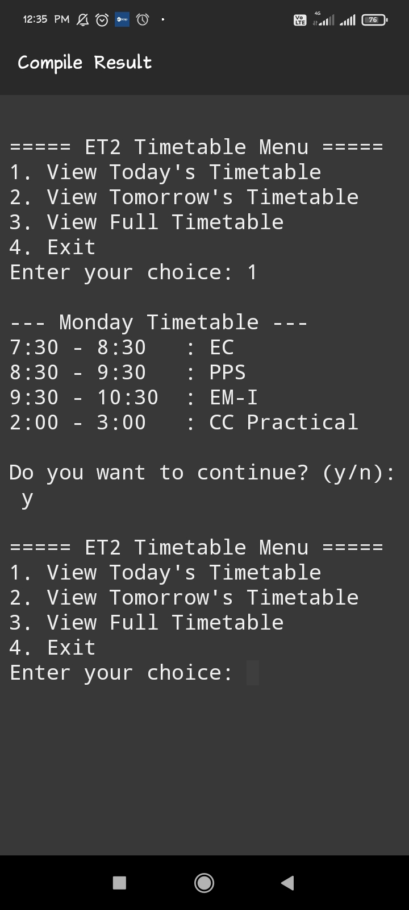

# 📅 ET2 Timetable Viewer (C Program)

A simple console-based C program to view the daily or full weekly class timetable for ET2 students using the current system day.

---

# ✅ Features

View today's timetable (automatically detects current weekday)

View tomorrow's timetable

Display the full weekly timetable

Clearly marked weekend/holiday

Simple menu-driven interface

Looped menu with continue/exit prompt

---

# 🛠️ Technologies Used

Language: C

Libraries Used:

stdio.h – for input/output

string.h – for string comparison

time.h – for fetching current day from the system

---

# 📷 Sample Output

===== ET2 Timetable Menu =====

1. View Today's Timetable
   
2. View Tomorrow's Timetable

3. View Full Timetable
   
4. Exit
   
Enter your choice: 1

--- Monday Timetable ---

7:30 - 8:30   : EC

8:30 - 9:30   : PPS

9:30 - 10:30  : EM-I

2:00 - 3:00   : CC Practical

Do you want to continue? (y/n):

---

# 🙌 Author

Developed by girishmohakar

Feel free to fork, contribute, or customize the timetable as per your class schedule.

---

# 📃 Screenshot 

---

